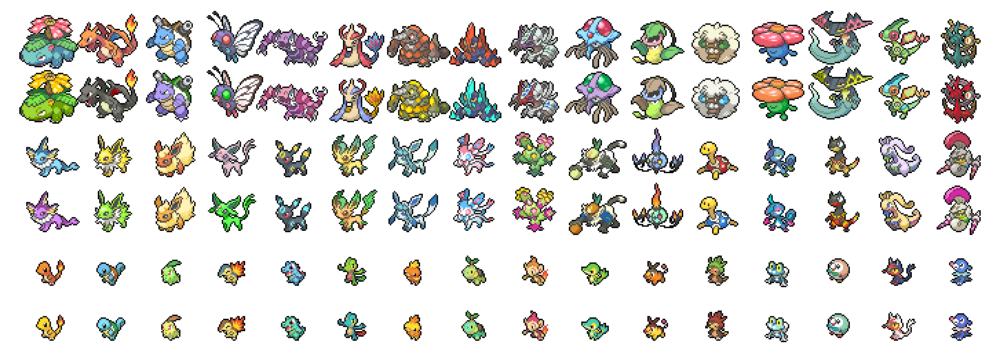
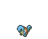
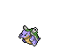
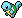
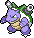
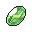
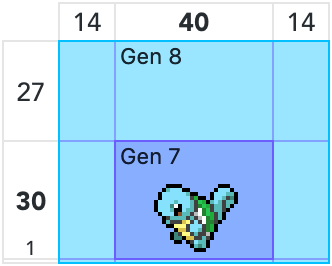
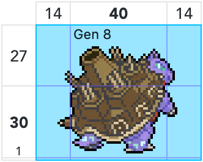
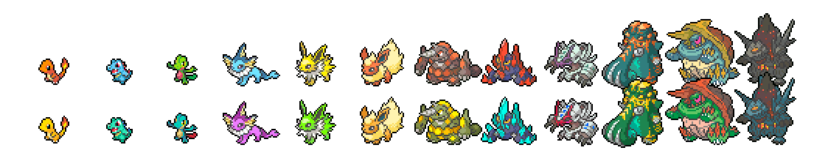

# Pokémon Sprites

This is a collection of sprites of Pokémon from the main game series, ranging from collectibles to box sprites. It includes both official and custom versions of sprites that may not be available in-game.

**Examples of sprites:**

These sprites can be used as individual files, or accessed programmatically using the included sprite database files.

## Sprites and metadata

This project contains both Pokémon box sprites and item sprites. For Pokémon, both the old style sprites from *Pokémon Sun/Moon* (Gen 7) and the new style sprites from *Pokémon Sword/Shield* (Gen 8), including the DLC, are included. Item sprites are available with Gen 8 style white outlines and without.

| Directory | Example1 | Example2 | Size | Type | Description |
|:-----------|:-------:|:-------:|:----------|:-----|:------------|
| `/pokemon‑gen7` |  |  | 68×56 | Pokémon | [Gen 7 Sprites](https://msikma.github.io/pokesprite/overview/dex-gen7.html), updated for Gen 8 size/contrast |
| `/pokemon‑gen8` |  |  | 68×56 | Pokémon | [Gen 8 Sprites](https://msikma.github.io/pokesprite/overview/dex-gen8.html) (plus older sprites where needed) |
| `/items` |  | | 32×32 | Item | [Gen 3–8 inventory items](https://msikma.github.io/pokesprite/overview/inventory.html) |
| `/misc` |  |  | Varies | Misc. | [Miscellaneous sprites](https://msikma.github.io/pokesprite/overview/misc.html) from multiple gens |

The original 40×30 Pokémon sprites from Gen 6–7 are kept for legacy purposes in the [`/icons`](icons/) directory.

## Sprite Dimensions

Since Gen 8, Pokémon box sprites have become 68×56 (up from 40×30 in Gen 7) to accommodate larger sprite designs. 

&nbsp;&nbsp;&nbsp;

Most Pokémon did not get a new sprite as of Gen 8, meaning their old sprite was padded to the new size. Sprites were padded from below.

Since most Pokémon take up a very small amount of pixels of the allotted space, they'll look far more spaced apart than in Gen 7 if they're displayed adjacent to each other. This effect is especially noticeable for not-fully-evolved Pokémon.

To somewhat mitigate this, the sprites can be made to overlap each other. In nearly all cases, only the empty space around the sprite will overlap—if there are multiple large sprites next to each other (like several Gigantamax forms) the sprites themselves will overlap, but only a little.

The recommended overlap is **-24px left** and **-16px top**, which is a compromise between bringing the smaller sprites closer together and not letting the larger sprites overlap. **Here's an example of what that looks like:**

With this setup, the larger sprites are quite close together but not uncomfortably so, and the smaller sprites are not too far away from each other. There is some small overlap for the largest sprites (the special Gigantamax forms), but not excessively so, and in most cases it should be rare to see multiple Gigantamax forms next to one another since it's not a permanent form.

For a better example of what many adjacent sprites look like with this setup, see the banner image at the top of the readme, which also uses the same amount of spacing.

## Related projects

**Projects using PokéSprite:**

* **[PokéSprite spritesheet](https://github.com/msikma/pokesprite-spritesheet/)** – spritesheet of all Pokémon box sprites and inventory items for use in websites
* **[PikaSprite](https://github.com/arcanis/pikasprite)** – a different interface for PokéSprite sprites
* [Spinda Painter](https://msikma.github.io/spinda-spots/) – proof of concept for displaying accurate Spinda spots on its box sprite

**Pokémon artwork related links:**

* [Project Pokémon - Animated 3D sprites index](https://projectpokemon.org/docs/spriteindex_148/)
* [Bulbapedia - List of game sprites](https://archives.bulbagarden.net/wiki/Category:Game_sprites) – contains many other graphics and icons not included in this project
* [PokéDings](https://github.com/msikma/PokeDings) – webfont and SVG icons of special characters used in Pokémon nicknames
* [PokéResources](https://github.com/msikma/pokeresources) – Various Pokémon image resources

## License

The sprite images are © Nintendo/Creatures Inc./GAME FREAK Inc.

Everything else is governed by the [MIT license](http://opensource.org/licenses/MIT).

See [the contributors file](contributors.md) for further information.
